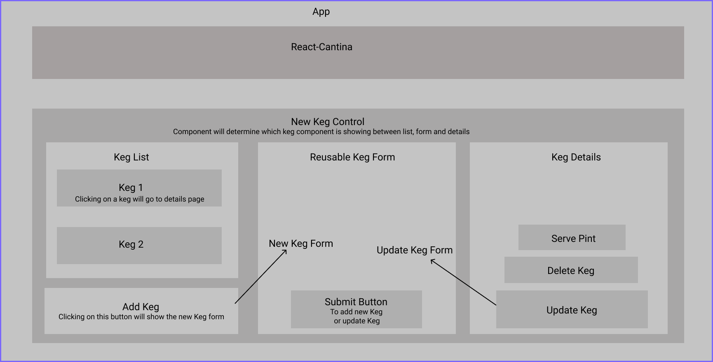

# _React-Cantina_

#### _This is React Application that tracks the kegs at a Cantina, 9.11.2020_

#### By _**Taylor Phillips**_

## Description

_This is a React application that allows the user to add a keg to a list with details about the beverage inside.  The user can continue to add additional kegs, select a keg to see more about the details of what's inside.  The user is also able to select a keg to take a pint from it.  User can then look at the details and see how much of the beverage is remaining._

### User Stories:

* User is able to select `AddKeg` form to view the form for adding a beverage
* User will enter details about the beverage and add to the list
* User is able to see a list of kegs to be selected
* User is able to select a keg to see more detailed information about the beverage the keg contains
* User is able to 'ServePint' out of keg and see the pints remaining go down in its details
* User can both update a keg and delete a particular keg if need be

## Setup/Installation Requirements

* _Install Git Bash_
* _Using a Terminal on desktop, user will need to type git init_
* _Clone file to desktop from repo on github_
* _Navigate to project folder using command line type: `cd Desktop` followed by `cd React-Cantina`_
* _In Command Line, type, `npm install` and wait for the application to complete it's action_
* _Then type `npm run build` in the command line terminal_
* _Finally type `npm start` to use the application_

 
<!-- This is my diagram, to move wherever I need it in my readme: -->

 
 

## Known Bugs

_Currently no known bugs, please report them to Taylor_

## Support and contact details

_Contact me at <taylorphillips133@gmail.com>_

## Technologies Used

* _HTML_
* _CSS_
* _Bootstrap_
* _JavaScript_
* _VSCode_
* _REACT_
* _Figma - for diagram_

This project was bootstrapped with [Create React App](https://github.com/facebook/create-react-app).

## Available Scripts

In the project directory, you can run:

### `npm start`

Runs the app in the development mode. 
Open [http://localhost:3000](http://localhost:3000) to view it in the browser.

The page will reload if you make edits. 
You will also see any lint errors in the console.

### `npm test`

Launches the test runner in the interactive watch mode. 
See the section about [running tests](https://facebook.github.io/create-react-app/docs/running-tests) for more information.

### `npm run build`

Builds the app for production to the `build` folder. 
It correctly bundles React in production mode and optimizes the build for the best performance.

The build is minified and the filenames include the hashes. 
Your app is ready to be deployed!

See the section about [deployment](https://facebook.github.io/create-react-app/docs/deployment) for more information.

### `npm run eject`

**Note: this is a one-way operation. Once you `eject`, you can’t go back!**

If you aren’t satisfied with the build tool and configuration choices, you can `eject` at any time. This command will remove the single build dependency from your project.

Instead, it will copy all the configuration files and the transitive dependencies (webpack, Babel, ESLint, etc) right into your project so you have full control over them. All of the commands except `eject` will still work, but they will point to the copied scripts so you can tweak them. At this point you’re on your own.

You don’t have to ever use `eject`. The curated feature set is suitable for small and middle deployments, and you shouldn’t feel obligated to use this feature. However we understand that this tool wouldn’t be useful if you couldn’t customize it when you are ready for it.

## Learn More

You can learn more in the [Create React App documentation](https://facebook.github.io/create-react-app/docs/getting-started).

To learn React, check out the [React documentation](https://reactjs.org/).

### Code Splitting

This section has moved here: https://facebook.github.io/create-react-app/docs/code-splitting

### Analyzing the Bundle Size

This section has moved here: https://facebook.github.io/create-react-app/docs/analyzing-the-bundle-size

### Making a Progressive Web App

This section has moved here: https://facebook.github.io/create-react-app/docs/making-a-progressive-web-app

### Advanced Configuration

This section has moved here: https://facebook.github.io/create-react-app/docs/advanced-configuration

### Deployment

This section has moved here: https://facebook.github.io/create-react-app/docs/deployment

### `npm run build` fails to minify

This section has moved here: https://facebook.github.io/create-react-app/docs/troubleshooting#npm-run-build-fails-to-minify

### License

Copyright (c) 2020 **_Taylor Phillips_**